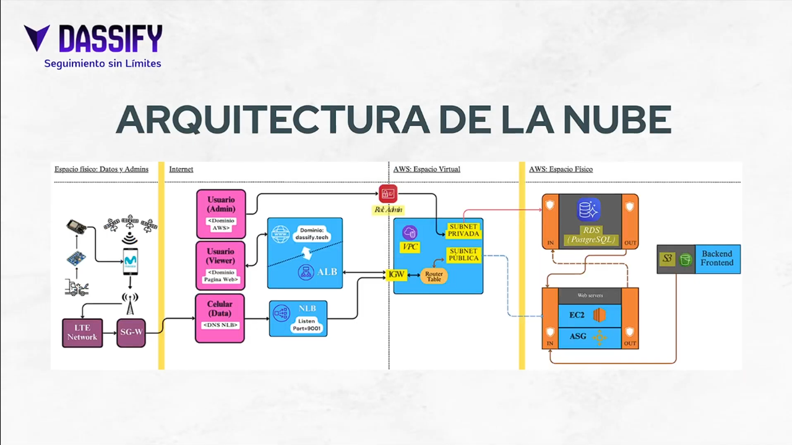

# Dassify – IoT Cargo Monitoring Platform

## Descripción del Proyecto

**Dassify** es una plataforma web IoT diseñada para el monitoreo del estado físico de cargas durante su transporte. El sistema permite registrar vibraciones, choques y datos de geolocalización generados por dispositivos IoT y visualizarlos en una interfaz web para su análisis.

La solución integra dispositivos basados en **ESP32**, sensores acelerómetros de tres ejes y una infraestructura cloud desplegada en **AWS**, permitiendo el procesamiento y almacenamiento de datos de telemetría provenientes del transporte de mercancías.

---

## Propósito

El objetivo del sistema es proporcionar trazabilidad y monitoreo del estado físico de la carga durante su transporte, permitiendo:

- Registrar eventos de vibración o impacto
- Almacenar datos de telemetría georreferenciados
- Visualizar información mediante una plataforma web
- Analizar zonas de riesgo durante rutas de transporte

Este proyecto fue desarrollado como parte de un **proyecto académico universitario**, enfocado en la integración de hardware, software y servicios en la nube.

---

## Arquitectura del Sistema

El sistema sigue una arquitectura basada en la nube desplegada en **Amazon Web Services (AWS)**.  

Los dispositivos IoT generan datos de telemetría relacionados con la posición y las vibraciones de la carga. Estos datos son transmitidos hacia la infraestructura cloud mediante una **aplicación Android**, que actúa como punto de enlace utilizando comunicación **UDP**.

El **backend**, desarrollado en **Python utilizando FastAPI**, procesa la información recibida y gestiona el acceso a la base de datos mediante **SQLAlchemy ORM**. Los datos son almacenados en **PostgreSQL**, permitiendo su posterior consulta y análisis.

El **frontend**, desarrollado con **Angular**, permite visualizar la información del sistema mediante una interfaz web.

### Diagrama de Arquitectura

El siguiente diagrama muestra la arquitectura general del sistema y la interacción entre sus componentes principales.

---

## Tecnologías Utilizadas

### Backend

- **Python**
- **FastAPI**
- **SQLAlchemy (ORM)**
- **APIs REST**
- **Comunicación UDP para ingesta de telemetría**

### Frontend

- **Angular**

### Base de Datos

- **PostgreSQL**

### Infraestructura Cloud

- **Amazon Web Services (AWS)**
- EC2
- RDS
- VPC
- Load Balancers
- S3

---

## Mi Contribución al Proyecto

Durante el desarrollo del sistema participé como **desarrollador principal en varias capas del proyecto**, incluyendo:

- Desarrollo del **backend** utilizando **Python y FastAPI**
- Diseño e implementación del **modelo de base de datos PostgreSQL**
- Integración de la base de datos mediante **SQLAlchemy ORM**
- Desarrollo e integración del **frontend web**
- Desarrollo de la **aplicación Android** encargada de transmitir telemetría mediante **UDP**
- Colaboración en el diseño de la arquitectura cloud del sistema en **AWS**
- Modificaciones iniciales en el firmware del dispositivo **ESP32**

Nota: El código fuente del firmware del dispositivo IoT no se encuentra disponible en este repositorio.

---

## Repositorios Relacionados

El proyecto está dividido en múltiples repositorios:

- **Plataforma Web (backend + frontend)** — este repositorio
- **Aplicación Android para transmisión de telemetría** —  [Dassify-IoT-Application](https://github.com/MendozaJose2001/Dassify-IoT-Android-Application)

---

## Video de Presentación

Video de demostración del proyecto:

https://www.youtube.com/watch?v=TVhq5wv0I18

---

## Autores

Proyecto académico desarrollado por:

- Christopher Cabana  
- Laura Santiago  
- José Daniel Mendoza  

---

## Contexto Académico

Este proyecto fue desarrollado como parte de un **proyecto universitario**, enfocado en la integración de tecnologías **IoT, computación en la nube y desarrollo de aplicaciones web** para el monitoreo de sistemas físicos.
